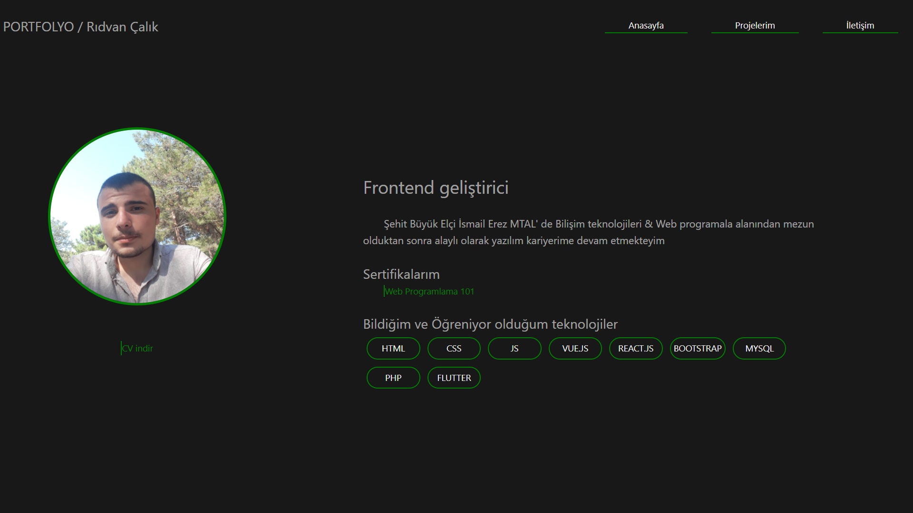

# **Rıdvan Çalık**

***This is my web site make with vue.js***


[Live web site ](https://ridvan-calik-w.web.app)


> light theme


> dark theme



## Project Setup

```sh
npm install
```

### Compile and Hot-Reload for Development

```sh
npm run dev
```

### Compile and Minify for Production

```sh
npm run build
```
